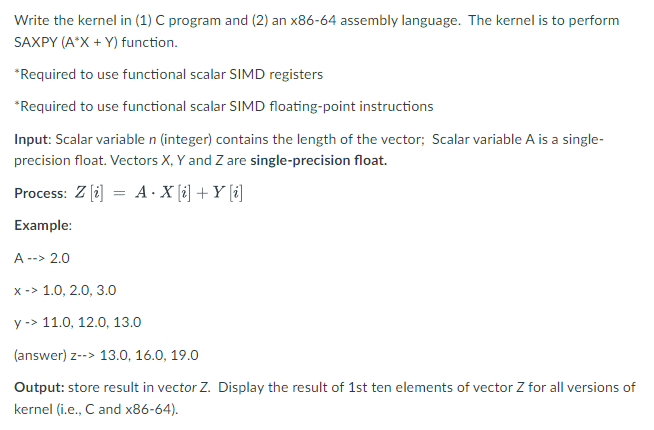

# LBYARCH-MCO2 
### Alyanna Cabrera, S15 
### Samuel Cheng, S15

## Project Description
### This project involves implementing kernels (in C and in x86-64 assembly) capable of performing the SAXPY (A*X + Y) function. The kernel must utilize functional scalar SIMD registers and floating-point instructions. The output of the kernel should display the result of the first ten elements of vector Z for both versions of the kernel (C and x86-64 assembly).
### This project is executed both in debug mode and release mode using three different vector sizes: 220, 224, and 228. This is to see and compare the execution time of the two execution modes. See screenshot of the problem below.

## Debug Mode

### Vector Size = 220
| Time in ms | C | x86-64 Assembly |
|----------|----------|----------|
| Total Time | 81.0000 | 49.0000 |
| Average Time | 2.7000 | 1.6333 |

### Vector Size = 224
| Time in ms | C | x86-64 Assembly |
|----------|----------|----------|
| Total Time | 1116.0000 | 563.0000 |
| Average Time | 37.2000 | 18.7667 |

### Vector Size = 228
| Time in ms | C | x86-64 Assembly |
|----------|----------|----------|
| Total Time | 17399.0000 | 8139.0000 |
| Average Time | 579.9667 | 271.3000 |

### Average Time Summary for Debug Mode
| Average Time in ms | 220 | 224 | 228 |
|----------|----------|----------|----------|
| C | 2.7000 | 37.2000 | 579.9667 |
| x86-64 Assembly | 1.6333 | 18.7667 | 271.3000 |
| **Faster** | x86-64 Assembly | x86-64 Assembly | x86-64 Assembly |

#### One possible reason why the x86-64 Assembly code was faster is because it provides more direct control over hardware resources, resulting in more optimized code execution compared to C. Additionally, Assembly code bypasses some of the overhead associated with high-level compilation, potentially contributing to its faster performance.

---

## Release Mode

### Vector Size = 220
| Time in ms | C | x86-64 Assembly |
|----------|----------|----------|
| Total Time | 41.0000 | 36.0000 |
| Average Time | 1.3667 | 1.2000 |

### Vector Size = 224
| Time in ms | C | x86-64 Assembly |
|----------|----------|----------|
| Total Time | 543.0000 | 559.0000 |
| Average Time | 18.1000 | 18.6333 |

### Vector Size = 228
| Time in ms | C | x86-64 Assembly |
|----------|----------|----------|
| Total Time | 8131.0000 | 8120.0000 |
| Average Time | 271.0333 | 270.6667 |

### Average Time Summary for Release Mode
| Average Time in ms | 220 | 224 | 228 |
|----------|----------|----------|----------|
| C | 1.3667 | 18.1000 | 271.0333 |
| x86-64 Assembly | 1.2000 | 18.6333 | 270.6667 |
| **Faster** | x86-64 Assembly | C | x86-64 Assembly |

#### The results above indicate that C code performs better in release mode than in debug mode, as although x86-64 Assembly is mostly faster than C, the time difference is much smaller compared to the time difference in debug mode. This difference may stem from the optimizations applied to the C code and kernel in release mode. In debug mode, all optimizations for C are disabled, whereas certain optimizations are enabled for release mode. 

---
## Correctness Check
#### To verify the correctness of our result we printed the results of C and x86-64 Assembly together for the 30 runs of each vector: 220, 224, and 228. We then made sure that the results are identical to each other to ensure correctness. See the pictures below for the screenshots of the command line.

### Vector Size = 220 
| Debug Mode | Release Mode |
|----------|----------|
|  |  |

### Vector Size = 224 
| Debug Mode | Release Mode |
|----------|----------|
|  |  |

### Vector Size = 228 
| Debug Mode | Release Mode |
|----------|----------|
|  |  |

## Comparative Analysis
#### From the results above, it can be observed that both kernels run slightly slower when run in debug mode than in release mode. This is likely because running debug mode typically includes additional checks and other debugging features, whereas release mode places more emphasis on optimizing the code's performance. 

#### The C kernel runs much faster in release mode than in debug mode, even outperforming the assembly code in some cases. This is because of the optimization performed in release mode, as C compilers offer various optimization levels that can significantly improve performance.

#### Lastly, the results also highlight the capabilities of Assembly code in offering greater control and optimization opportunities compared to higher-level languages like C. Due to its proximity to the hardware, Assembly grants us finer control over system resources, enabling us to optimize the code's performance as much as possible without relying on a complex compiler.
